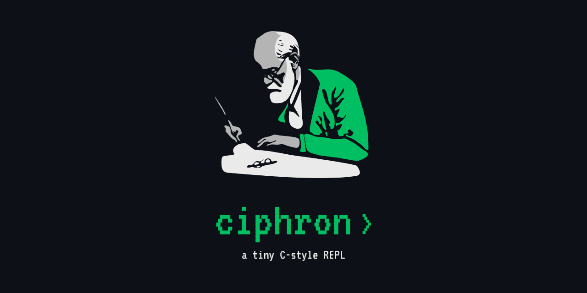

<p align="center">
  
</p>

# Ciphron

**Introspection for your code.**

## 🚀 What is Ciphron?

Ciphron is a tiny C-style REPL (Read-Eval-Print Loop) that lets you declare variables, print values, and introspect types right from your terminal. Inspired by C syntax, it’s a playground for anyone curious about interpreters.

## ✨ Features

- **Declare** integer and string variables at runtime
- **Print** the value of any defined variable
- **Type introspection**: use `:t varname` to check a variable’s type (just like Haskell)
- **Error messages** for unknown variables or invalid syntax
- **Minimal, hackable codebase**—easy to read and extend

## 🛠️ Installation

**Requirements:**

- GCC or any C compiler

**Build with:**

```bash
git clone https://github.com/antoniocaporrini/ciphron.git
cd ciphron
make
./ciphron
```
